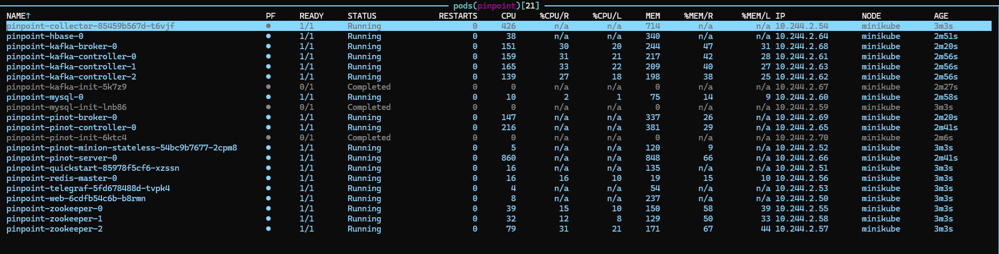
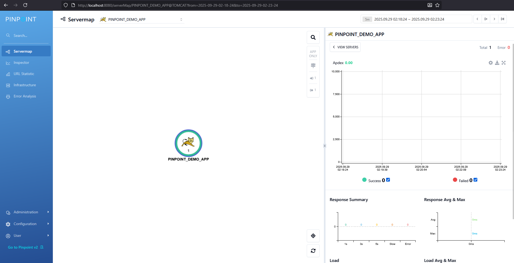
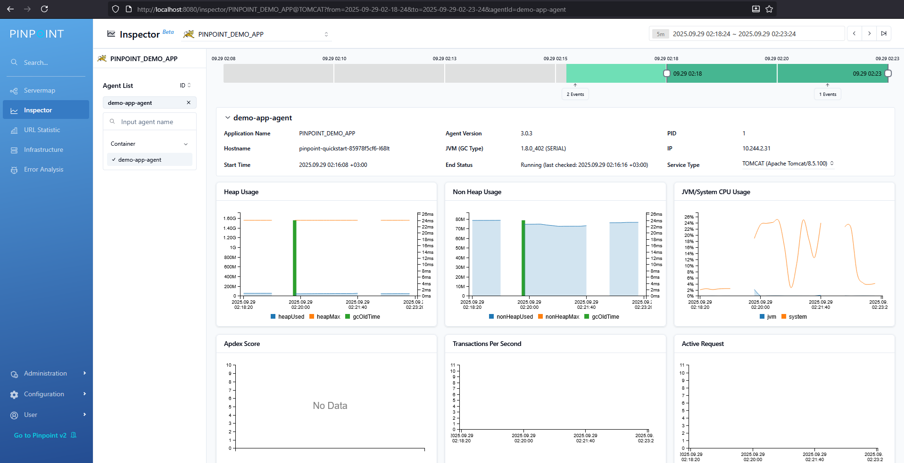
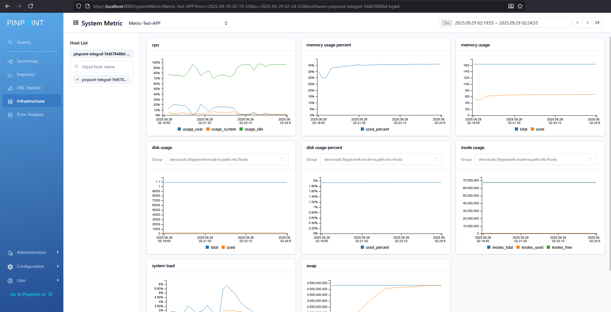

# Pinpoint Helm Chart

  

A Helm chart for deploying Pinpoint APM on Kubernetes.

## Introduction

This chart bootstraps a [Pinpoint APM](https://pinpoint-apm.github.io/pinpoint/) deployment on a Kubernetes cluster using the Helm package manager.

## Installing the Chart

To install the chart with the release name `pinpoint`:

```bash
git clone https://github.com/pinpoint-apm/pinpoint-kubernetes.git
cd pinpoint-kubernetes
helm dependency update
```

### Deployment modes

This chart supports two deployment modes:

**Metric Profile (default):**
```bash
helm install pinpoint . -n pinpoint --create-namespace
```
Deploys Kafka, Pinot, and Telegraf for advanced metrics collection.

**Classic Mode:**
```bash
helm install pinpoint . -n pinpoint --create-namespace --set global.metric.enabled=false
```
Deploys Batch and Flink modules for traditional APM processing.

> **Note:** You may see warnings about `SessionAffinity is ignored for headless services`. These are harmless warnings and do not affect functionality.

## Parameters

### Global parameters

| Name | Description | Value |
|------|-------------|-------|
| `global.metric.enabled` | Enable metric profile deployment | `true` |
| `global.pinpointVersion` | Pinpoint version | `"3.0.3"` |
| `global.image.pullPolicy` | Image pull policy | `IfNotPresent` |

## Accessing Pinpoint

After installation, you can access the Pinpoint services:

**Web UI:**
```bash
kubectl port-forward svc/pinpoint-web 8080:8080 -n pinpoint
```
Then open http://localhost:8080 in your browser.

**Pinot Controller UI (Real-time Data Management):**
```bash
kubectl port-forward svc/pinpoint-pinot-controller 9000:9000 -n pinpoint
```
Then open http://localhost:9000 in your browser.

## Uninstalling the Chart

To uninstall the `pinpoint` deployment:

```bash
helm uninstall pinpoint -n pinpoint
```

## Resources

- [Pinpoint Documentation](https://pinpoint-apm.gitbook.io/pinpoint/)
- [GitHub Issues](https://github.com/pinpoint-apm/pinpoint-kubernetes/issues)

## Screenshots

### Kubernetes Deployment


### Pinpoint Web Dashboard



