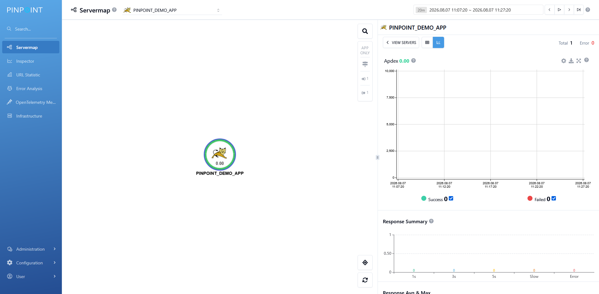

# Pinpoint Helm Chart

[](https://github.com/pinpoint-apm/pinpoint-kubernetes/actions/workflows/helm-ci.yaml)


[](LICENSE)

Open-source Helm chart for running
[Pinpoint APM](https://github.com/pinpoint-apm/pinpoint) on Kubernetes.
Chart `3.1.0` deploys Pinpoint `3.1.0`.

## Install

Requires a Kubernetes cluster, Helm 3, and `kubectl`.

```bash
helm repo add pinpoint https://pinpoint-apm.github.io/pinpoint-kubernetes
helm repo update

helm upgrade --install pinpoint pinpoint/pinpoint \
  --version 3.1.0 \
  --namespace pinpoint \
  --create-namespace \
  --wait \
  --timeout 20m
```

The default metric profile includes MySQL, HBase, ZooKeeper, Kafka, Redis,
Pinot, and Telegraf. Make sure the cluster has enough CPU, memory, and storage.

Check the installation:

```bash
kubectl get pods,jobs,pvc -n pinpoint
```

Open the Pinpoint UI:

```bash
kubectl port-forward service/pinpoint-web 8080:8080 -n pinpoint
```

Visit <http://localhost:8080>.

## Configuration

Use the classic Batch and Flink profile instead of the default metric profile:

```bash
helm upgrade --install pinpoint pinpoint/pinpoint \
  --version 3.1.0 \
  --namespace pinpoint \
  --create-namespace \
  --set global.metric.enabled=false
```

To use external Redis and Kafka, disable the bundled services and provide their
endpoints in a values file:

```yaml
global:
  redis:
    host: redis.example.internal
    port: 6379
    passwordSecret:
      name: pinpoint-redis
      key: password
  kafka:
    bootstrapServers: kafka-0.example.internal:9092,kafka-1.example.internal:9092

redis:
  enabled: false

kafka:
  enabled: false
```

External services do not block Pinpoint pod startup. Kafka topics are assumed
to be managed externally; set `global.kafka.manageExternalTopics=true` only if
this Helm release should create them.

Enable the optional chart-managed NetworkPolicies with:

```yaml
networkPolicy:
  enabled: true
```

See [`values.yaml`](values.yaml) for all configuration options and
[`docs/UPGRADING.md`](docs/UPGRADING.md) before upgrading a production release.

## Uninstall

```bash
helm uninstall pinpoint --namespace pinpoint
```

PersistentVolumeClaims may remain after uninstall. Review retained data before
deleting them.

## Screenshot



## License

[Apache License 2.0](LICENSE)
