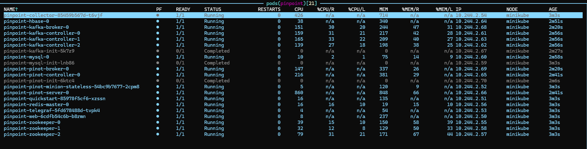
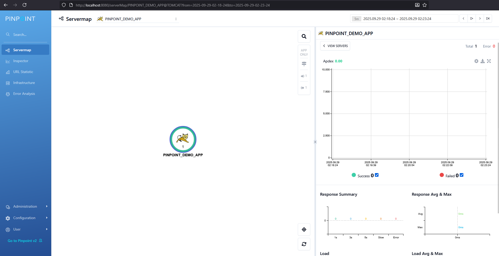
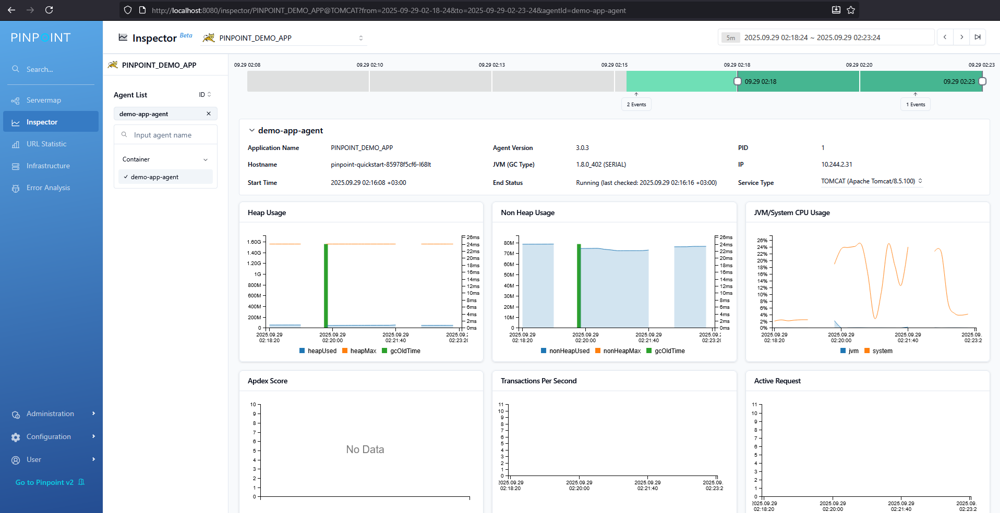
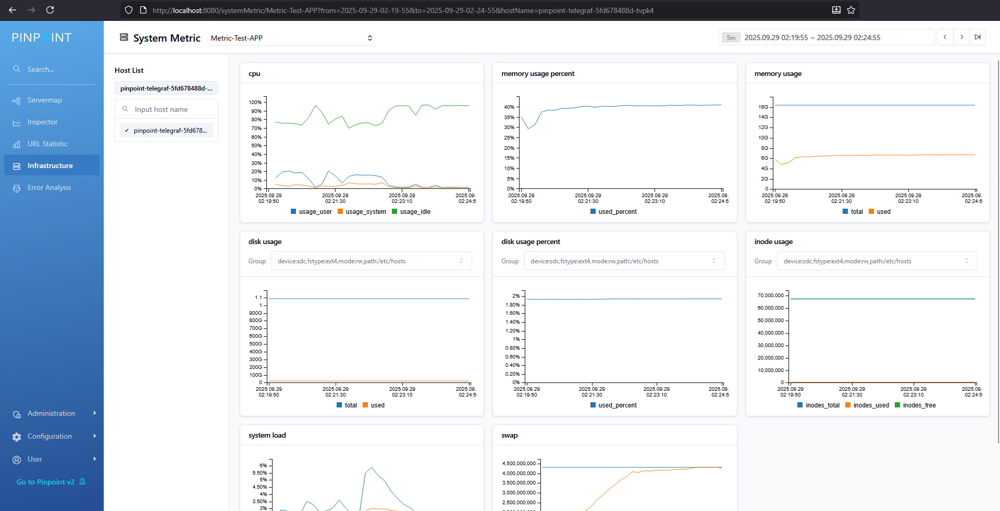

# Pinpoint Helm Chart

  

A Helm chart for deploying Pinpoint APM on Kubernetes.

## Introduction

This chart bootstraps a [Pinpoint APM](https://pinpoint-apm.github.io/pinpoint/) deployment on a Kubernetes cluster using the Helm package manager.

## Installing the Chart

Add the Pinpoint chart repository and install the chart with the release name `pinpoint`:

```bash
helm repo add pinpoint https://pinpoint-apm.github.io/pinpoint-kubernetes
helm repo update
helm install pinpoint pinpoint/pinpoint -n pinpoint --create-namespace
```

To install directly from source instead, clone the repository, run
`helm dependency build`, and use `helm install pinpoint .`.

### Deployment modes

This chart supports two deployment modes:

**Metric Profile (default):**
```bash
helm install pinpoint pinpoint/pinpoint -n pinpoint --create-namespace
```
Deploys Kafka, Pinot, and Telegraf for advanced metrics collection.

**Classic Mode:**
```bash
helm install pinpoint pinpoint/pinpoint -n pinpoint --create-namespace --set global.metric.enabled=false
```
Deploys Batch and Flink modules for traditional APM processing.

> **Note:** You may see warnings about `SessionAffinity is ignored for headless services`. These are harmless warnings and do not affect functionality.

### External Redis and Kafka

The bundled Redis and Kafka dependencies can be disabled independently. The
following example uses an existing Redis Secret and assumes Kafka topics are
managed outside this Helm release:

```yaml
global:
  redis:
    host: redis.example.internal
    port: 6380
    username: pinpoint
    passwordSecret:
      name: pinpoint-redis-credentials
      key: password
  kafka:
    bootstrapServers: kafka-0.example.internal:9092,kafka-1.example.internal:9092
    createTopics: false

redis:
  enabled: false

kafka:
  enabled: false
```

Use `global.redis.password` instead of `passwordSecret` only when storing a
plain-text password in Helm values is acceptable. When
`global.kafka.createTopics=true`, the chart's Kafka initialization job creates
the required Pinpoint topics on the configured external brokers.

## Parameters

### Global parameters

| Name | Description | Value |
|------|-------------|-------|
| `global.metric.enabled` | Enable metric profile deployment | `true` |
| `global.pinpointVersion` | Pinpoint version | `"3.0.3"` |
| `global.image.pullPolicy` | Image pull policy | `IfNotPresent` |
| `global.datasource.enabled` | Enable global datasource configuration<br/>- `true` (default): Injects datasource env vars. Defaults to the bundled MySQL if `mysql.enabled` is true.<br/>- `false`: No datasource env vars are injected into Web/Batch. | `true` |
| `global.datasource.driverClassName` | JDBC driver class name<br/>- Defaults to the MySQL driver from the chart dependency | `""` |
| `global.datasource.jdbcUrl` | JDBC URL for external database<br/>- Defaults to the MySQL service from the chart dependency | `""` |
| `global.datasource.username` | Database username<br/>- Defaults to the MySQL username from the chart dependency | `""` |
| `global.datasource.passwordSecret.name` | Secret name containing password | `""` |
| `global.datasource.passwordSecret.key` | Key in the Secret containing the password | `""` |
| `global.datasource.password` | Database password (Not RECOMMENDED for production)<br/>- Defaults to the MySQL password from the chart dependency | `""` |
| `global.redis.host` | External Redis hostname; required when `redis.enabled=false` | `""` |
| `global.redis.port` | External Redis port | `6379` |
| `global.redis.username` | External Redis username | `""` |
| `global.redis.passwordSecret.name` | Secret containing the external Redis password | `""` |
| `global.redis.passwordSecret.key` | Password key in the external Redis Secret | `""` |
| `global.redis.password` | Plain-text external Redis password (not recommended) | `""` |
| `global.kafka.bootstrapServers` | External Kafka bootstrap servers; required when `kafka.enabled=false` | `""` |
| `global.kafka.createTopics` | Run the Kafka topic initialization job | `true` |
| `redis.enabled` | Deploy the bundled Redis dependency | `true` |
| `kafka.enabled` | Optional override for bundled Kafka; otherwise inherits `global.metric.enabled` | unset |

## Accessing Pinpoint

After installation, you can access the Pinpoint services:

**Web UI:**
```bash
kubectl port-forward svc/pinpoint-web 8080:8080 -n pinpoint
```
Then open http://localhost:8080 in your browser.

**Pinot Controller UI (Real-time Data Management):**
```bash
kubectl port-forward svc/pinpoint-pinot-controller 9000:9000 -n pinpoint
```
Then open http://localhost:9000 in your browser.

## Uninstalling the Chart

To uninstall the `pinpoint` deployment:

```bash
helm uninstall pinpoint -n pinpoint
```

## Resources

- [Pinpoint Documentation](https://pinpoint-apm.gitbook.io/pinpoint/)
- [GitHub Issues](https://github.com/pinpoint-apm/pinpoint-kubernetes/issues)

## Screenshots

### Kubernetes Deployment


### Pinpoint Web Dashboard



